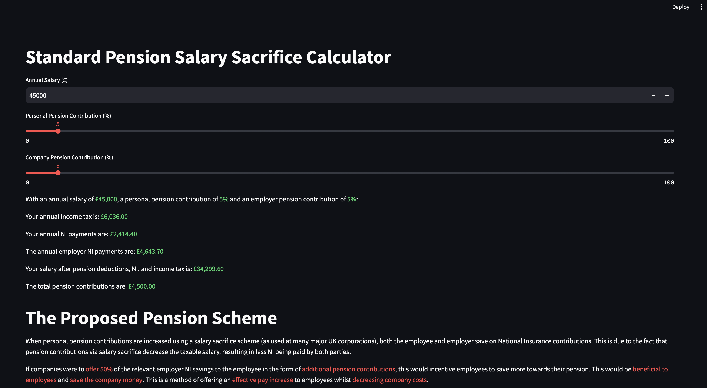
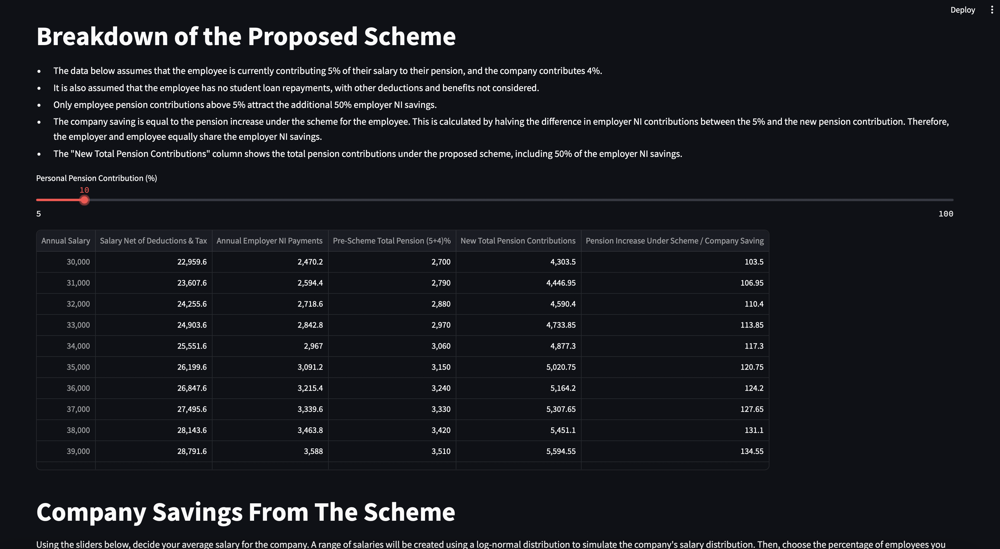
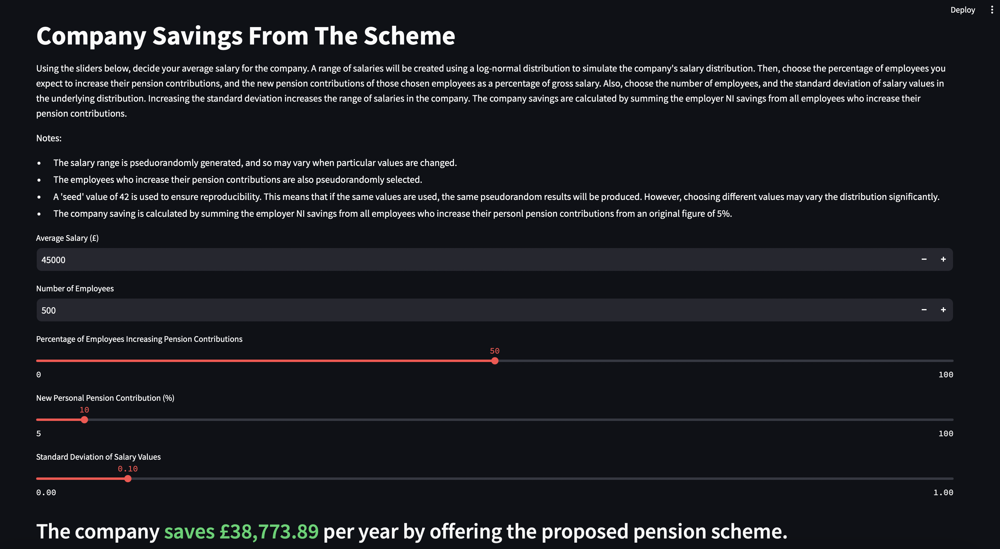
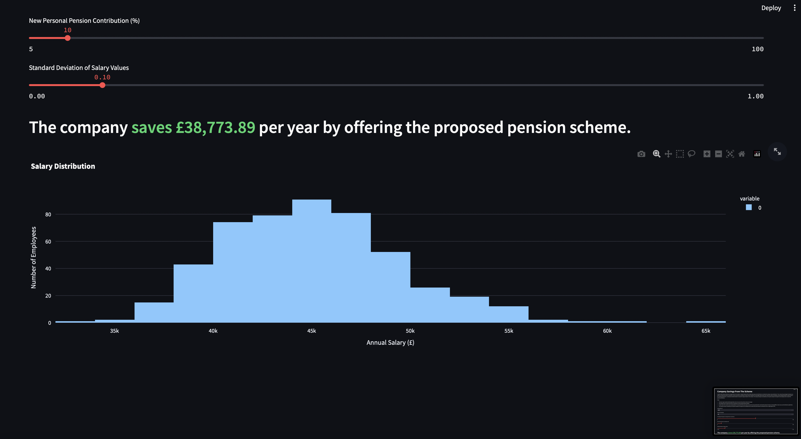

# UK salary sacrifice pension contribution calculator

### To see this app hosted, click here: [Calculator](https://uk-pension-contribution-calculator-7wusgmuh2hcjcllrarnc7g.streamlit.app)

When utilising a salary sacrifice scheme, employers and employees typically both contribute towards an employee's pension. However, an employee
contributing under said scheme reduces their taxable salary. Given that income tax, and both employee and employer national insurance (NI) 
contributions are based on the taxable salary, increasing employee/personal pension contributions can be a tax efficient way of increasing effective overall renumeration. Increasing employee pension contributions decreases taxes paid by both parties.



## Aim of this calculator

The calculator calculates:

- Annual income tax
- Annual NI payments for employee and employer
- Salary after pension, income tax, and NI (take home salary)
- Total pension contributions

However, this calculator also aims to explain an innovative scheme that can be used to **encourage** larger employee pension contributions.
When employee pension contributions are increased, the employer pays less NI. Encouraging employees to increase their contributions increases their 
effective overall renumeration, and decreases employer costs. Therefore, this UI breaks down how giving **50%** of the employer NI savings to
the employee in the form of additional pension contributions can benefit both employee and employer.

A breakdown of the savings for the employer and employee are calculated in a table, based on the new pension contribution.



Finally, variables can be altered to show how much money a company could save by using such a scheme, assuming the scheme indeed encourages
employees to increase contributions. The variables to be altered are:

- Average salary (of employees at relevant company)
- Number of employees
- Percentage of employees increasing contributions
- New personal pension contributions as a percentage of gross salary
- Standard deviation of salary values in the underlying log-normal distribution.

The company saving based on all variables selected is calculated, along with a graph showing the estimated distribution of salaries at the company.




## How to install & use

Conda was used as a package manager during development of this application. However, Streamlit Community Cloud has bugs when using environment.yml - Conda's equivalent of `requirements.txt`. Therefore, `pipreqs` was used to create a `requirements.txt` file, similar to that of Pip. `pipreqs` only records those modules actually used within a project, as opposed to Pip's `pip freeze`, which includes all modules in an environment, regardless of usage. Therefore, to run this project, follow the steps below.

### Provision a new environment

```bash
python3 -m venv [environment_name]
```

### Activate the virtual environment (MacOS / Linux)

```bash
source [environment_name]/bin/activate
```

### Activate the virtual environment (Windows)

```shell
.\env\Scripts\activate
```

### Install required packages using pip

```bash
pip install -r requirements.txt
```

## Disclaimer

The data and opinions presented in this calculator are for illustrative purposes only, and should not be taken as financial advice.
I am not a financial advisor, and the information presented may not be accurate or up-to-date. 
Please consult a suitably qualified financial advisor before making any financial decisions.